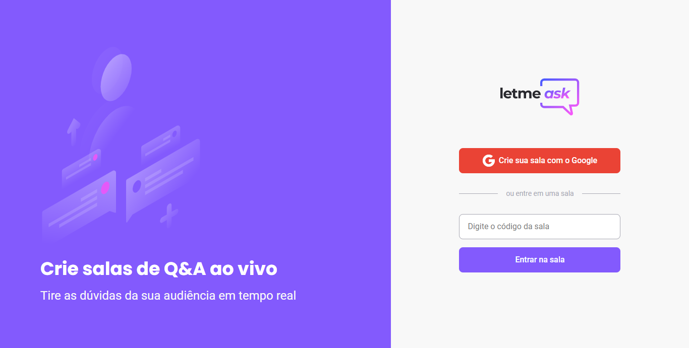
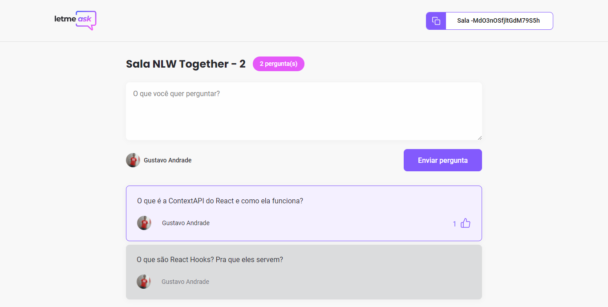
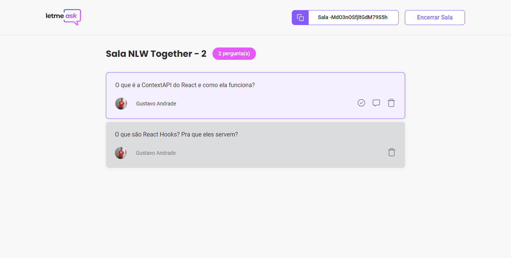

<p align="center">
  
</p>

<p align="center">
  
  
  

     
</p>

<h1 align="center">
  
</h1>

<br>

## 🧪 Tecnologias

Esse projeto foi desenvolvido com as seguintes tecnologias:

- [React](https://reactjs.org)
- [Firebase](https://firebase.google.com/)
- [TypeScript](https://www.typescriptlang.org/)
- [Sass](https://sass-lang.com/)


## 🚀 Como executar

Clone o projeto e acesse a pasta do mesmo.

```bash
$ git clone https://github.com/gustavinho-dev/letmeask-nlw-together.git
```

Para iniciá-lo, siga os passos abaixo:

1. Execute o comando `yarn` para instalar todas as dependências.
2. Execute `yarn start` para inicializar o projeto.

O app estará disponível no seu browser pelo endereço http://localhost:3000.


## 💻 Projeto

Letmeask é perfeito para criadores de conteúdos poderem criar salas de Q&A com o seu público, de uma forma muito organizada e democrática. 

Esse é um projeto desenvolvido durante a **Next Level Week Together**, apresentada pela Rocketseat dos dias 20 a 27 de Junho de 2021.


## 📷 Screenshots

<p align="center">
  
</p>

<p align="center">
  

  
</p>


## 🔖 Layout

Você pode visualizar o layout do projeto através do link abaixo:

- [Layout Web](https://www.figma.com/file/u0BQK8rCf2KgzcukdRRCWh/Letmeask/duplicate) 

Lembrando que você precisa ter uma conta no [Figma](http://figma.com/).


## 📝 License

Esse projeto está sob a licença MIT. Veja o arquivo [LICENSE](LICENSE.md) para mais detalhes.

---

<p align="center">Feito com 💜 by Gustavo Pacheco 👋🏻 </p>
